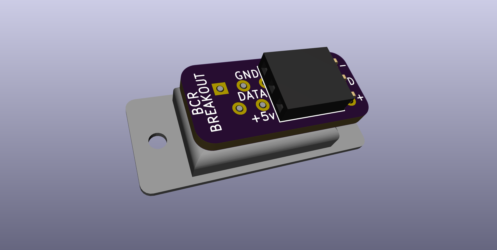
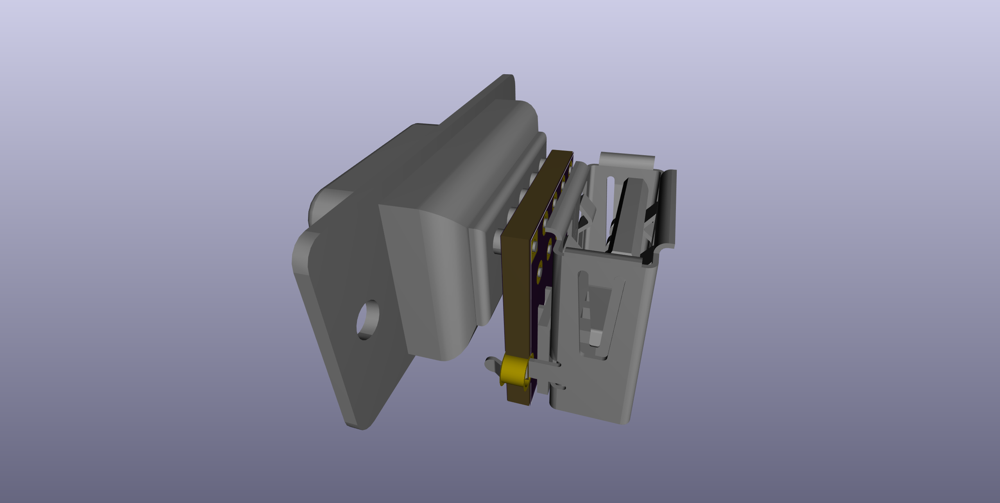

# BCR Breakout
  
<a href="https://oshpark.com/shared_projects/MTOWfRkz"></img></a>

## Parts
* [BOM for BCR_Breakout](https://www.digikey.com/short/zbf5mf)

Breakout board to connect to the BCR port of TRS-80 Model 100 and similar machines.

Works on the following machines and any others that have this standard of barcode reader port:

TRS-80/TANDY Model 100, 102, 200  
NEC PC-8201, PC-8201a, PC-8300  
Olivetti M10  

# BCR USB Power
|Horizontal|Vertical (not for T102)|
|:---:|:---:|
|||
|<a href="https://oshpark.com/shared_projects/mTFeysVg"></img></a>|<a href="https://oshpark.com/shared_projects/OHdw5nqN"></img></a>|

## Parts
* [BOM for BCR_USB_PWR](https://www.digikey.com/short/zb4hr4)

5v USB power from the BCR port

# Directions

1: Solder the Dsub9 connector on the side of the board that says "DE9F SIDE".  
Flush-cut the Dsub9 legs.

2: Position the 3-pin or USB socket on the other side of the board.  
If USB, bend the two shield tabs inwards to clamp onto the oval pads.  
Solder the shield tabs and socket legs.  
Flush-cut the socket legs.
