# BCR_USB_PWR
Adapter to make it more convenient to access the +5dvc power available on the BCR port of TRS-80 Model 100 and similar machines.

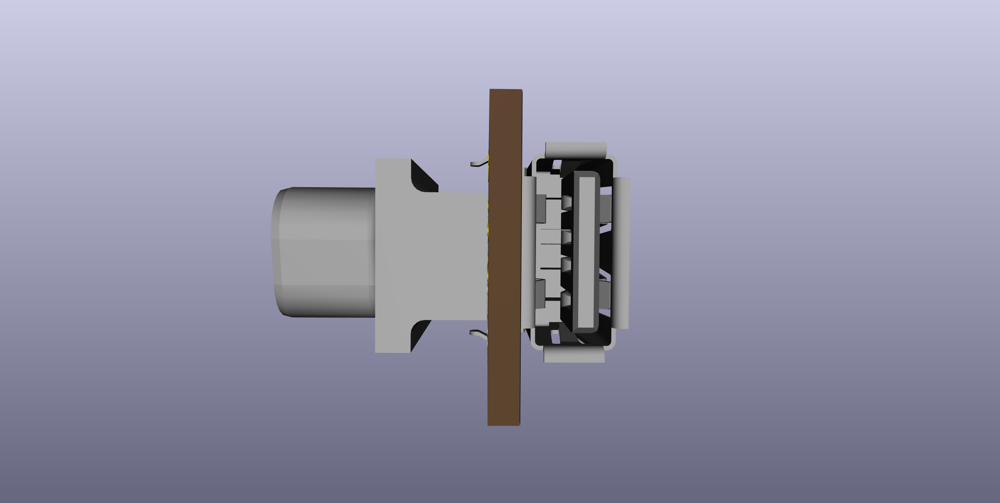

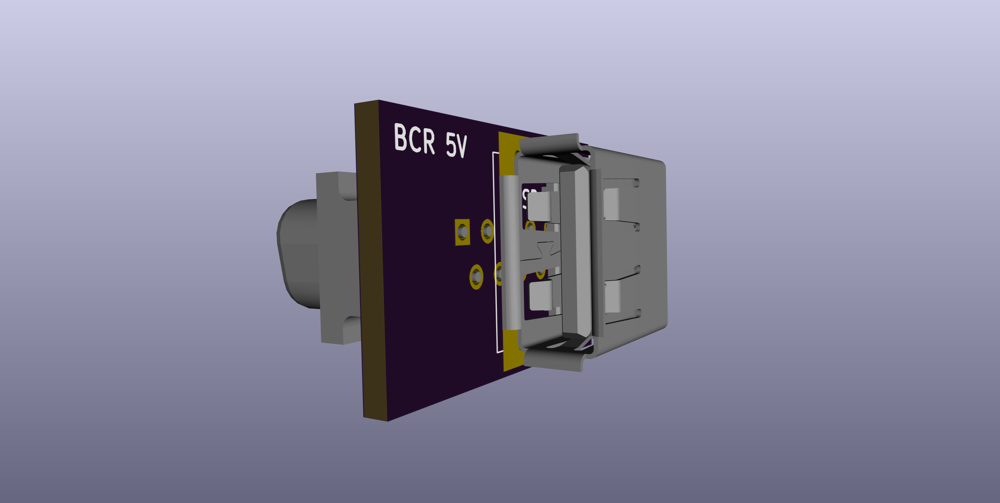

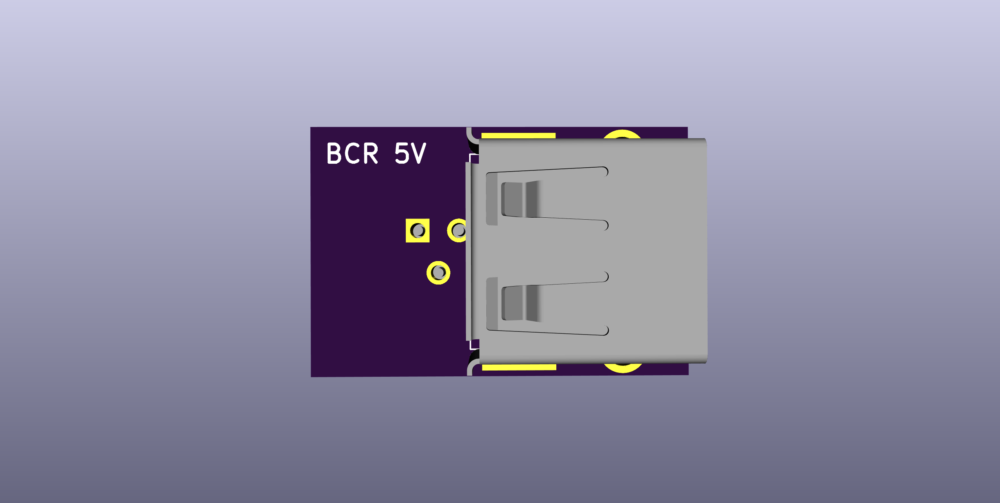

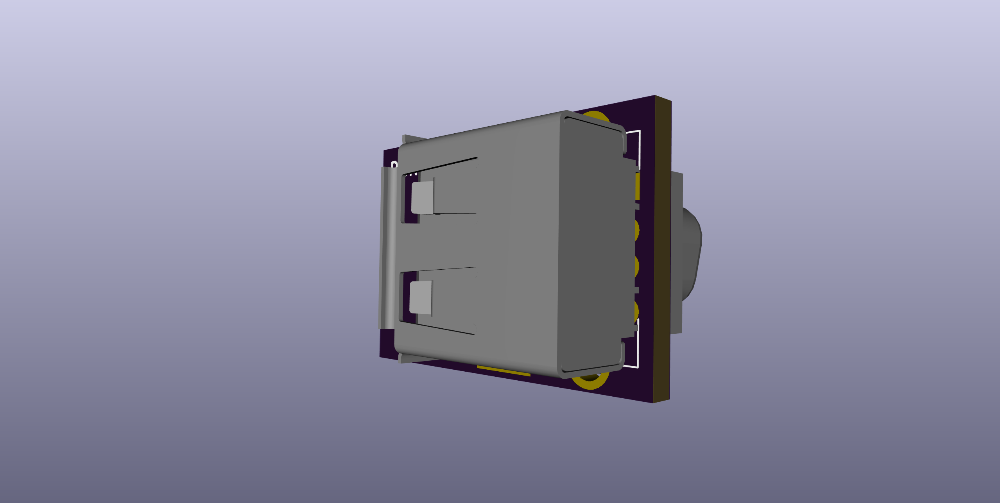

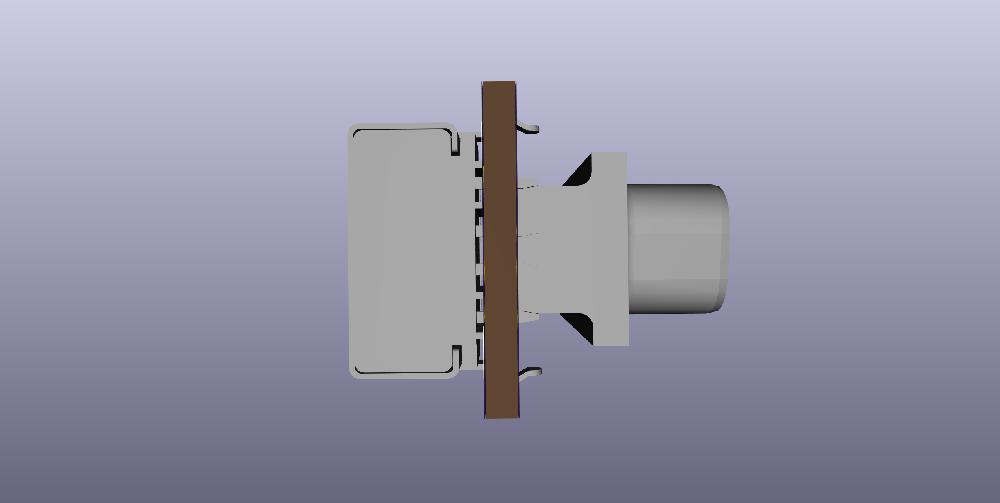

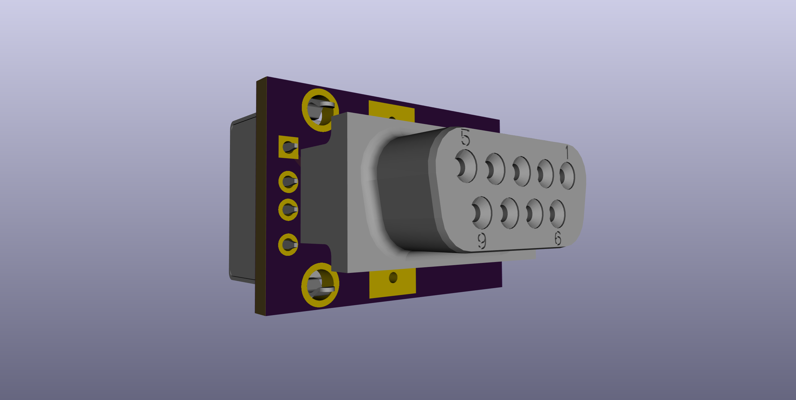

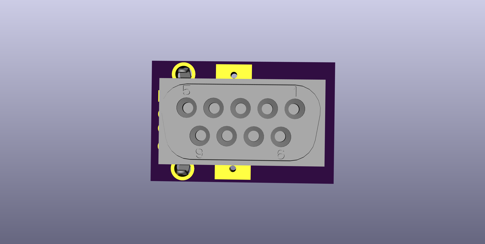

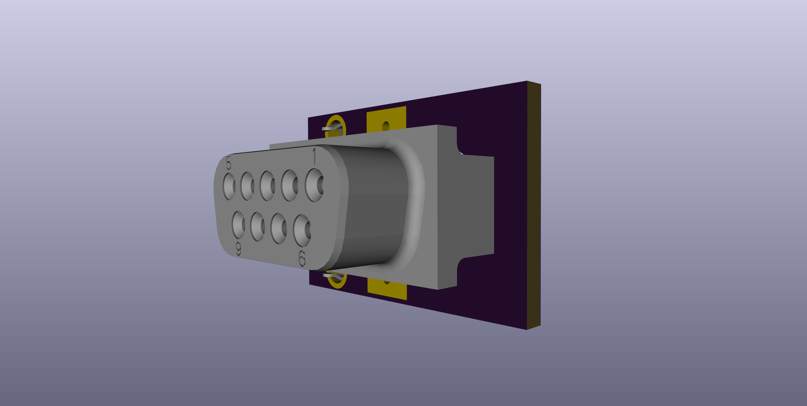

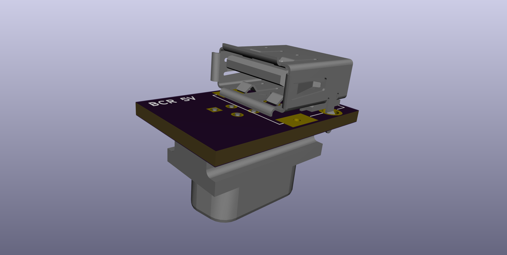

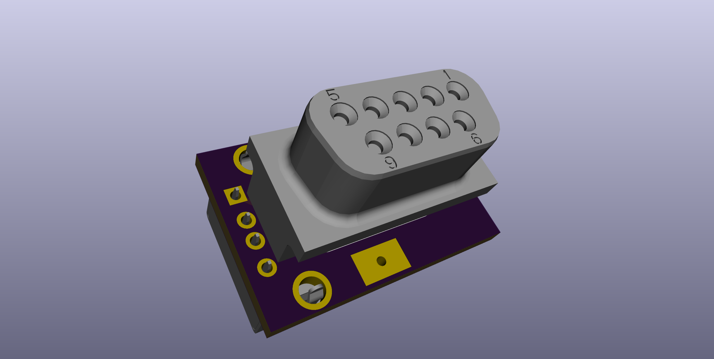

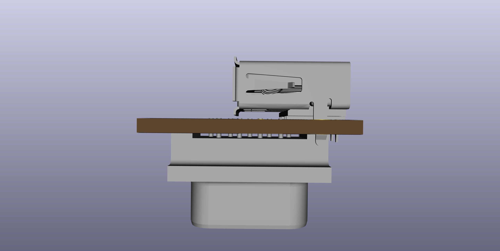

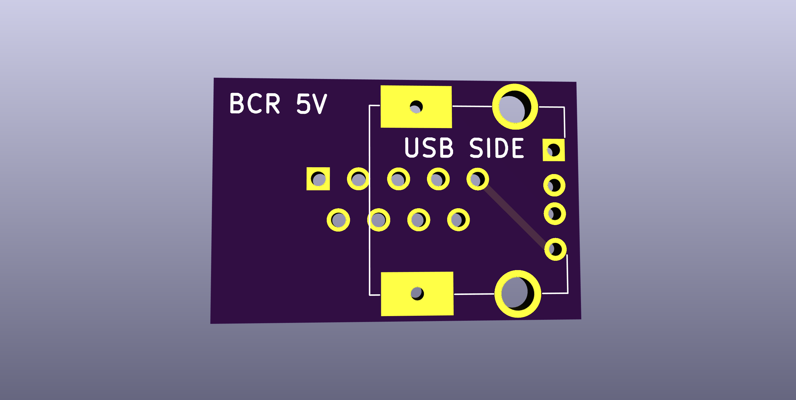

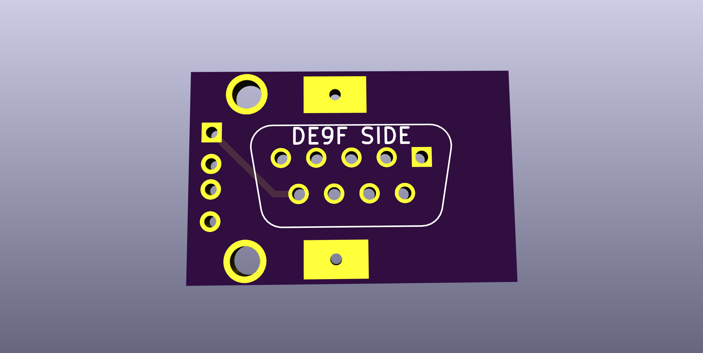

## NEC PC-8201 / PC-8201a / PC-8300

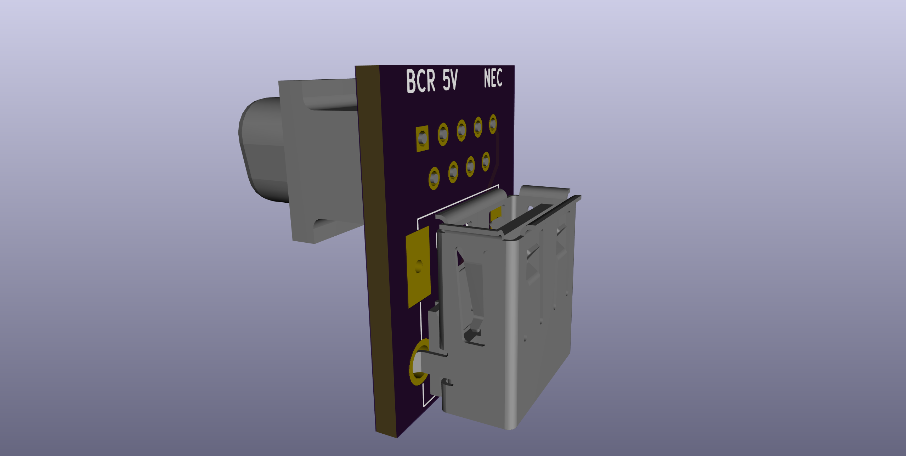

## Parts
* [PCB for Tandy](https://oshpark.com/shared_projects/uBcxaymt)
* [PCB for NEC](https://oshpark.com/shared_projects/pU895scG)
* [BOM](https://www.digikey.com/short/zb3bvr)

## Directions

1: Break or cut the screw-hole flanges off the sides of the DE9F connector, so that the plug is 25mm long or shorter after.

2: Solder the DE9F connector so that the connector body is on the DE9F side of the board.

3: Flush-cut the soldered legs.

4: Install and solder the USB connector on the USB side of the board.

Don't worry about the proximity of the 2 pins of the DE9 to the USB shield. One is already a ground, and the other is the RXD and is safe to ground. The only pin that you have to worry about shorting is pin# 9. If you fush-cut all the pins as the directions above, that pin will not be close to the shield.

