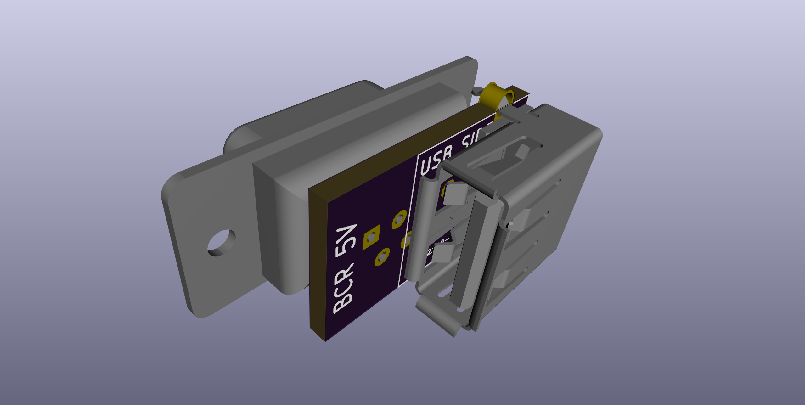

# BCR_USB_PWR

Adapter to make it more convenient to access the +5dvc power available on the BCR port of TRS-80 Model 100 and similar machines.

Works on the following machines and any others that have this standard of barcode reader port:

TRS-80/TANDY Model 100, 102, 200  
NEC PC-8201, PC-8201a, PC-8300  
Olivetti M10  

## Parts
* [BOM](https://www.digikey.com/short/zb4hr4)

## Directions

1: Solder the DE9F connector so that the connector body is on the DE9F side of the board.

2: Cut the soldered legs flush on the USB side of the board. As flat and close to the pcb surface as you can with flush cutters.

3: Position the USB socket on the USB side of the board. Bend the two shield tabs inwards and under the edge of the DE9F connector to clamp onto the oval pads. Be careful that one of the shield tabs does not touch the square usb pin.

## Notes

Don't worry about the exposed pins near the open end of the usb socket. They are all either not connected to anything or ok to touch to ground or to each other. The only pin that must be protected is safely buried under the usb connector.

---

There are several other variations of this adapter in this directory. On the TANDY 102 and NEC, the usb cable could point in a better direction. So there are special versions of the adapter for 102 and NEC, but in both of those cases the altered arrangement ends up exposing the 5v and GND pins right where the metal usb plug may touch them when inserting a usb cable. These adapters pose a high risk of shorting out the 5v rail inside the computer and killing it.

To use either the 102 or NEC adapters, I would recommend doing this:

* Before soldering the DE9F connector, cut the legs down *shorter* than the thickness of the PCB. So that, when you put the connector in place, the pins just poke into the holes a little, and do not stick out the other side at all. Then solder the pins using flux to ensure it flows and wets well, and leave a flat smooth surface on top with little or no solder balled up on top, either flat or vey shallow and smooth dome. If you can feel a pin sticking out of the surface, cut it shorter before soldering. If the solder is leaving a point every time you remove the iron, add flux and melt it again. The main thing is, when you are done, you want *no sharp points*, and as shallow bumps as possible.

* After soldering the DE9F connector, cover the soldered pads with a tough tape that won't wear through where the solder bumps are, and won't just fall off in a year from drying out or degrading. Electrical tape will do if it's all you have, but Kapton would be better. Or even better, glue down a piece of paper card stock or plastic sheet, but not too thick because the usb plug needs to occupy that space. It might be possible to simply paint the area with a coatiing, but it would need to be something very tough, and I have no suggestions what would be good enough.

---

The other variations are just options to use a different 9-pin connector that's all plastic, and options to have a slightly larger pcb that's easier to assemble because you don't have to bend the usb socket shield tabs over under the edge of the 9-pin connector. To view them, open any of the *.kicad_pcb files in KiCAD pcbnew, and then click View, 3d Viewer.

--- 

The Kyotronic KC-85 doesn't have a BCR port, so this is of no use with a KC-85.
